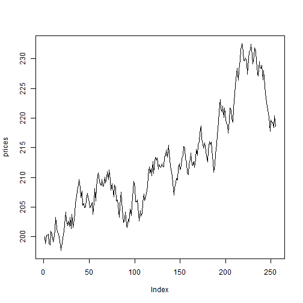

Monte Carlo Simulation of Stock Price
========================================================
author: Stanislav Prikhodko
date: May 20th, 2015

Monte Carlo Simulation
========================================================

Monte Carlo methods are a broad class of computational algorithms that rely on repeated random sampling to obtain numerical results. They are often used in physical and mathematical problems and are most useful when it is difficult or impossible to use other mathematical methods. In this research we will apply it for somilating stock price over time with given volatility.

On high level, many simulations performed in order to see what would be most likely the worst case scenario and the best case  scenario.

Input data for Stock Price simulations
========================================================

- **Starting price** - dollar amount of the stock price. By default $200.00 is used (which is about the price of *S&P 500* in the beggining of 2015) 
- **Drift** - normal growth rate. For example, use 0.03 if the growth rate is expected to be close to 3% average *annual* inflation rate (in the United States).
- **Volatility** - defines how volatile and how random this stock prices change over time. For example, the value 0.12 would stand for 12% which is close to S&P 500 volatility. Actually, this is standard deviation of return rates from the recent periods.

  

Mathematical background
========================================================

$$
dS_{t} = \mu S_{t} d_{t} + \sigma S_{t} dW_{t}
$$

Slide With Plot
========================================================

 
